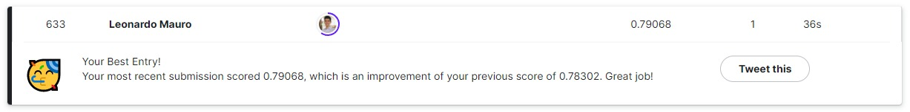
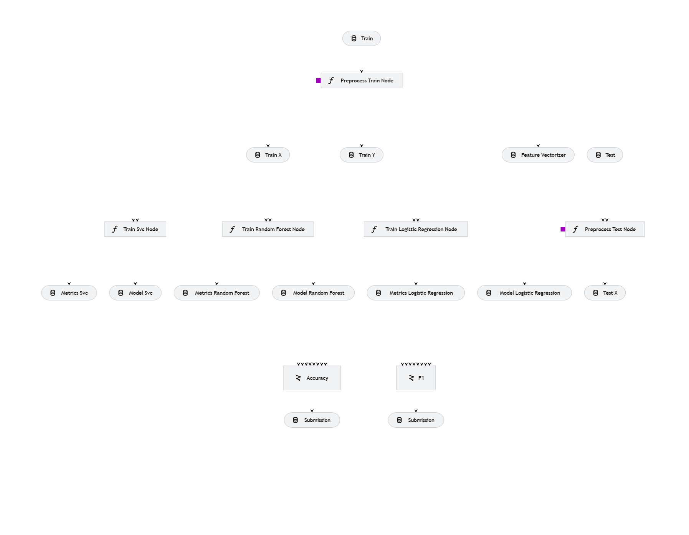

# Kedro + NLP Study
[](LICENSE)
[](https://github.com/leomaurodesenv/kedro-sklearn)
   

This repository is learning code for designing a solution using Kedro. [Kedro](https://kedro.org/) is an open sourced Python framework for creating maintainable and modular data science code as pipelines. In the project, we are going to design a solution for competition [Detection of Disaster Tweets using Natural Language Processing](https://www.kaggle.com/competitions/nlp-getting-started/) techniques.

> Note: This project contains the best performing solution I've gotten in this competition so far.

<p align="center"></p>

---
## Solution Architecture

All the code generate output files, such as `model.pickle` and `data.csv`; you can access them in [data folder](kedro-sklearn/data).

- [Preprocessing](kedro-sklearn/src/kedro_sklearn/pipelines/01_preprocessing) - Clean and tranform the text into vectors.
- [Training](kedro-sklearn/src/kedro_sklearn/pipelines/02_training) - Train many models, using k-fold cross validation and grid search.
- [Selection](kedro-sklearn/src/kedro_sklearn/pipelines/03_selection) - Select best model according to a specific metric.

<p align="center"></p>

---
## Code

Download or clone this repository.

### Data

1. Download the dataset in [Natural Language Processing with Disaster Tweets](https://www.kaggle.com/competitions/nlp-getting-started/data)
2. Extract all the files in `./kedro-sklearn/data/01_raw/` folder
3. Now, you can run the code using `kedro`!

### Running

```shell
## Create a Python environment
$ python -m venv .venv
$ source .venv/bin/activate

## Access the Kedro pipelines folder
$ cd kedro-sklearn

## Install requirements
$ pip install -r src/requirements.txt

## Running
$ kedro run
## Output:
# 2023-03-28 16:42:31,283 - kedro.framework.session.session - INFO - Kedro project kedro-sklearn
# 2023-03-28 16:42:33,769 - kedro.io.data_catalog - INFO - Loading data from 'train' (CSVDataSet)...
# 2023-03-28 16:42:33,815 - kedro.pipeline.node - INFO - Running node: preprocess_train_node: preprocess_train([train]) -> [train_vectorizer,train_X]
# 2023-03-28 16:42:34,180 - kedro_sklearn.pipelines.preprocessing.nodes - INFO - ## Train preprocessing
# 2023-03-28 16:42:34,180 - kedro_sklearn.pipelines.preprocessing.nodes - INFO - corpus size: 7613
# [...]

## Visualizing pipelines
$ kedro viz
# Open browser: http://127.0.0.1:4141/
```

---
## Also look ~

-   License [MIT](LICENSE)
-   Created by [leomaurodesenv](https://github.com/leomaurodesenv/)